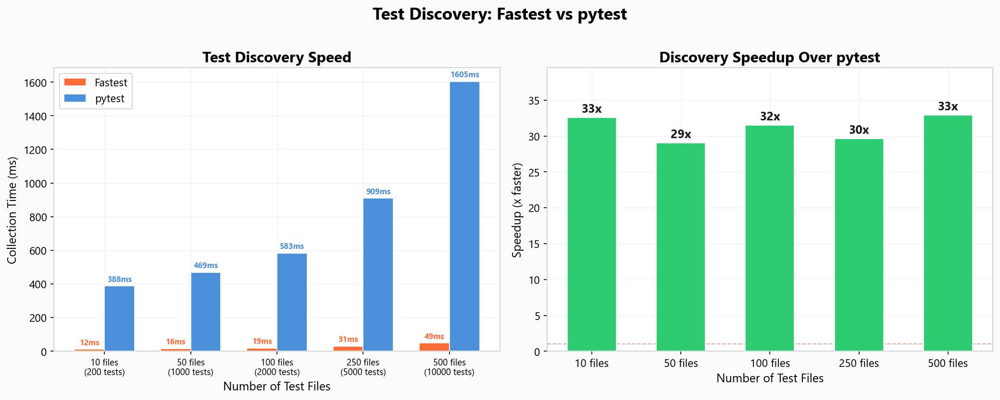
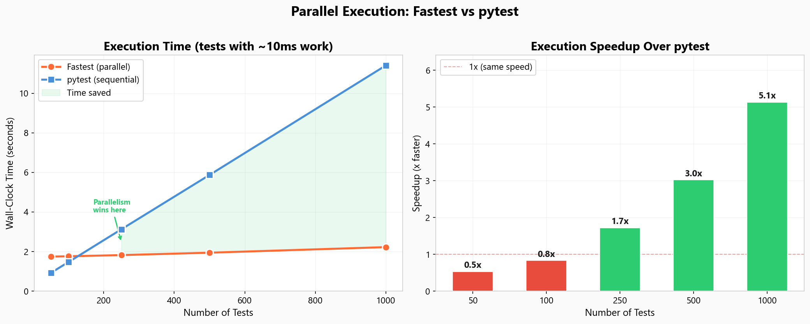

# Fastest - High-Performance Python Test Runner

[](https://github.com/derens99/fastest/actions)
[](https://opensource.org/licenses/MIT)

**Fastest** is a Python test runner written in Rust that discovers and executes pytest-style tests with parallel execution. It uses a hybrid execution engine that automatically selects between in-process (PyO3) and subprocess pool strategies based on suite size.

> **Beta Release** - Fastest v2 is a complete rewrite. Core discovery and execution work well, but some features are still being refined. Bug reports welcome!

## Performance

Fastest is built in Rust for speed. Here's how it compares to pytest on real benchmarks:

### Test Discovery: Up to 33x Faster

Fastest's Rust-based AST parser with parallel file scanning (via [rayon](https://github.com/rayon-rs/rayon)) collects tests dramatically faster than pytest's Python-based collection.

<p align="center">
  
</p>

| Test Files | Tests | Fastest | pytest | Speedup |
|-----------|-------|---------|--------|---------|
| 10 files | 200 | 12ms | 388ms | **33x** |
| 50 files | 1,000 | 16ms | 469ms | **29x** |
| 100 files | 2,000 | 19ms | 583ms | **32x** |
| 250 files | 5,000 | 31ms | 909ms | **30x** |
| 500 files | 10,000 | 49ms | 1,605ms | **33x** |

### Parallel Execution: Up to 5x Faster

For test suites where individual tests do real work (~10ms+ each), Fastest's parallel subprocess pool significantly outperforms pytest's sequential execution. The speedup grows with suite size.

<p align="center">
  
</p>

| Tests | Fastest | pytest | Speedup |
|-------|---------|--------|---------|
| 50 | 1.74s | 0.92s | 0.5x |
| 100 | 1.76s | 1.47s | 0.8x |
| 250 | 1.82s | 3.13s | **1.7x** |
| 500 | 1.94s | 5.87s | **3.0x** |
| 1,000 | 2.22s | 11.41s | **5.1x** |

> **Note:** For small suites (<100 tests) with trivial test bodies, pytest's single-process model has less overhead. Fastest's parallel engine shines as test count and individual test duration grow — which is the typical profile of real-world projects.

<details>
<summary><strong>Reproduce these benchmarks</strong></summary>

```bash
cargo build --release
python benchmarks/run_benchmarks.py
python benchmarks/generate_graphs.py
```

Results are saved to `benchmarks/results/`. Benchmarks run each configuration 5 times (after 1 warmup run) and report the mean. Measured on Windows with Python 3.12 and Rust release build (LTO enabled).
</details>

---

## Quick Start

### Install with pip (recommended)

```bash
pip install fastest-runner
```

### Install from source

```bash
git clone https://github.com/derens99/fastest
cd fastest
cargo build --release

# Binary at target/release/fastest
```

### Install from GitHub releases

Pre-built binaries are available for Linux (x86_64, aarch64), macOS (x86_64, aarch64), and Windows (x86_64) on the [Releases](https://github.com/derens99/fastest/releases) page.

### Usage

```bash
# Run all tests in current directory
fastest

# Run tests in specific directory
fastest tests/

# Discover tests without running
fastest discover tests/

# Filter by keyword expression
fastest -k "test_add or test_sub"

# Filter by marker expression
fastest -m "slow and not integration"

# Stop on first failure
fastest -x

# Verbose output
fastest -v

# Set worker count
fastest -j 4

# JSON output
fastest --output json

# JUnit XML report
fastest --junit-xml results.xml

# Incremental mode (only tests affected by uncommitted changes)
fastest --incremental

# Watch mode (re-run on file changes)
fastest --watch

# Re-run only last failed tests
fastest --lf

# Run failed tests first, then the rest
fastest --ff

# Ignore paths or patterns
fastest --ignore tests/legacy/ --ignore-glob "**/slow_*"

# Deselect specific tests
fastest --deselect tests/test_foo.py::test_bar

# Short test summary with report chars
fastest -r fEs
```

---

## Pytest Compatibility

Fastest is designed as a **drop-in replacement for pytest** on most projects. The tables below show a comprehensive feature-by-feature comparison so you know exactly what works today, what's partial, and what's not yet supported.

### Legend

| Symbol | Meaning |
|--------|---------|
| ✅ | Fully supported |
| 🟡 | Partially supported — works for common cases but may lack edge cases |
| ❌ | Not yet supported |
| 🚀 | Fastest-only feature — not available in pytest |

---

### Test Discovery

| Feature | pytest | Fastest | Notes |
|---------|--------|---------|-------|
| `test_*.py` / `*_test.py` files | ✅ | ✅ | Configurable via `python_files` |
| `test_*` functions | ✅ | ✅ | Configurable via `python_functions` |
| `Test*` classes | ✅ | ✅ | Configurable via `python_classes` |
| `test_*` methods in classes | ✅ | ✅ | |
| `async def test_*` functions | ✅ | ✅ | Detected and executed |
| Nested test classes (`Test* > Test*`) | ✅ | ✅ | Full `::` separated ID chain |
| Parametrize expansion | ✅ | ✅ | Cross-product of multiple decorators |
| `pytest.param()` with custom IDs | ✅ | ✅ | `pytest.param(val, id="name")` |
| `--collect-only` / `discover` | ✅ | ✅ | List tests without running |
| `conftest.py` discovery | ✅ | ✅ | Per-directory, deeper overrides shallower |
| `collect_ignore` / `collect_ignore_glob` | ✅ | ❌ | |
| Doctest collection | ✅ | ❌ | |
| Package-level `__init__.py` collection | ✅ | ❌ | |

### Markers

| Feature | pytest | Fastest | Notes |
|---------|--------|---------|-------|
| `@pytest.mark.skip` | ✅ | ✅ | With optional `reason=` |
| `@pytest.mark.skipif(condition)` | ✅ | ✅ | Condition expression evaluated |
| `@pytest.mark.xfail` | ✅ | ✅ | With optional `reason=` |
| `@pytest.mark.parametrize` | ✅ | ✅ | Single, multi-param, `ids=`, `pytest.param()` |
| `@pytest.mark.timeout` | ✅ | 🟡 | Parsed and stored, default 10s timeout enforced |
| `@pytest.mark.usefixtures` | ✅ | ✅ | Injects fixture deps at discovery |
| `@pytest.mark.filterwarnings` | ✅ | ❌ | |
| Custom markers | ✅ | ✅ | Any `@pytest.mark.X` works with `-m` filtering |
| `-m` marker expression filtering | ✅ | ✅ | `and`, `or`, `not`, `()` supported |
| `--strict-markers` | ✅ | ❌ | |

### Fixtures

| Feature | pytest | Fastest | Notes |
|---------|--------|---------|-------|
| `@pytest.fixture` from conftest.py | ✅ | ✅ | Per-directory discovery |
| Fixture dependency resolution | ✅ | ✅ | Topological sort with cycle detection |
| `scope="function"` | ✅ | ✅ | Default scope |
| `scope="class"` | ✅ | ✅ | Cached per-class with boundary detection |
| `scope="module"` | ✅ | ✅ | Cached per-module with boundary detection |
| `scope="package"` | ✅ | 🟡 | Parsed, treated as module scope |
| `scope="session"` | ✅ | ✅ | Cached for worker lifetime |
| `autouse=True` | ✅ | ✅ | Auto-injected into all tests in scope |
| `params=[...]` fixture parametrize | ✅ | ✅ | Fixture-level parametrization |
| `yield` fixtures (teardown) | ✅ | 🟡 | Basic support |
| Fixture finalizers (`request.addfinalizer`) | ✅ | ✅ | With `_run_finalizers()` cleanup |

#### Built-in Fixtures

| Fixture | pytest | Fastest | Notes |
|---------|--------|---------|-------|
| `tmp_path` | ✅ | ✅ | Temporary directory per test |
| `tmp_path_factory` | ✅ | ✅ | Factory for multiple temp dirs |
| `capsys` | ✅ | ✅ | Capture stdout/stderr |
| `capfd` | ✅ | ✅ | Real FD-level capture via `os.dup2()` |
| `caplog` | ✅ | ✅ | Full: handler, records, text, messages, set_level, clear |
| `monkeypatch` | ✅ | ✅ | setattr, delattr, setenv, delenv, chdir, syspath_prepend |
| `request` | ✅ | ✅ | addfinalizer, node info |
| `pytestconfig` | ✅ | 🟡 | Basic object, `getini()` returns defaults |
| `cache` | ✅ | 🟡 | In-memory per-session, not persisted to disk |
| `recwarn` | ✅ | ❌ | |
| `doctest_namespace` | ✅ | ❌ | |

### CLI Flags & Options

| Flag | pytest | Fastest | Notes |
|------|--------|---------|-------|
| `-k EXPR` | ✅ | ✅ | Keyword expression filter |
| `-m EXPR` | ✅ | ✅ | Marker expression filter |
| `-x` / `--exitfirst` | ✅ | ✅ | Stop on first failure |
| `--maxfail=N` | ✅ | ✅ | Stop after N failures |
| `-v` / `--verbose` | ✅ | ✅ | Verbose output with timings |
| `-q` / `--quiet` | ✅ | ✅ | Minimal output |
| `-s` | ✅ | ✅ | Disable output capture |
| `--tb=short\|long\|no` | ✅ | ✅ | Traceback format |
| `--durations=N` | ✅ | ✅ | Show N slowest tests |
| `--color=yes\|no\|auto` | ✅ | ✅ | Color output control |
| `--lf` / `--last-failed` | ✅ | ✅ | Re-run only failed tests |
| `--ff` / `--failed-first` | ✅ | ✅ | Failed tests first, then rest |
| `--collect-only` | ✅ | ✅ | Discover without running |
| `--junit-xml=PATH` | ✅ | ✅ | JUnit XML report |
| `-j` / `--workers` | ❌ | ✅ | 🚀 Parallel workers (pytest needs `xdist`) |
| `--watch` | ❌ | ✅ | 🚀 Built-in file watcher |
| `--incremental` | ❌ | ✅ | 🚀 Git-based change detection |
| `--no-progress` | ❌ | ✅ | 🚀 Disable progress bar |
| `--output json\|count` | ❌ | ✅ | 🚀 Native JSON & count formats |
| `-n` / `--numprocesses` (xdist) | ✅* | ❌ | *Requires `pytest-xdist` plugin |
| `--rootdir` | ✅ | ❌ | |
| `--override-ini` | ✅ | ❌ | |
| `-p` (plugin control) | ✅ | ❌ | |
| `--ignore` | ✅ | ✅ | Ignore path prefixes during collection |
| `--ignore-glob` | ✅ | ✅ | Ignore glob patterns during collection |
| `--deselect` | ✅ | ✅ | Deselect specific test IDs |
| `-r` / `--report` | ✅ | ✅ | Report summary chars: f/E/s/x/X/p |
| `--co` (collect-only short) | ✅ | ❌ | Use `discover` subcommand instead |

### Configuration

| Feature | pytest | Fastest | Notes |
|---------|--------|---------|-------|
| `pyproject.toml` (`[tool.pytest.ini_options]`) | ✅ | ✅ | Primary config source |
| `pytest.ini` | ✅ | ✅ | |
| `setup.cfg` (`[tool:pytest]`) | ✅ | ✅ | |
| `tox.ini` (`[pytest]`) | ✅ | ✅ | |
| `testpaths` | ✅ | ✅ | Directories to search |
| `python_files` | ✅ | ✅ | File patterns |
| `python_classes` | ✅ | ✅ | Class patterns |
| `python_functions` | ✅ | ✅ | Function patterns |
| `addopts` | ✅ | ✅ | Config-level CLI defaults |
| `markers` | ✅ | ✅ | Custom marker definitions |
| `minversion` | ✅ | 🟡 | Parsed but not enforced |
| `cache_dir` | ✅ | 🟡 | Parsed, uses `.fastest_cache/` |
| `filterwarnings` | ✅ | ❌ | |
| `norecursedirs` | ✅ | ✅ | Configurable + hardcoded defaults |
| `confcutdir` | ✅ | ❌ | |
| `[tool.fastest]` config section | ❌ | ✅ | 🚀 workers, incremental, verbose |

### Output & Reporting

| Feature | pytest | Fastest | Notes |
|---------|--------|---------|-------|
| Colored terminal output | ✅ | ✅ | ANSI colors, auto-detect terminal |
| Pass/fail/skip/xfail/xpass/error states | ✅ | ✅ | All 6 outcome states |
| Failure tracebacks | ✅ | ✅ | short, long, no modes |
| Slowest tests (`--durations`) | ✅ | ✅ | |
| JUnit XML | ✅ | ✅ | Full `<testsuites>` with stdout/stderr |
| Native JSON output | ❌ | ✅ | 🚀 `--output json` |
| Count-only summary | ❌ | ✅ | 🚀 `--output count` |
| Progress bar | ❌ | ✅ | 🚀 Spinner-based with live counter |
| Warnings summary | ✅ | 🟡 | Placeholder section shown |
| Short test summary (`-r`) | ✅ | ✅ | `FAILED id - error` format |
| Header / session info | ✅ | ❌ | |

### Execution

| Feature | pytest | Fastest | Notes |
|---------|--------|---------|-------|
| Sequential execution | ✅ | ✅ | |
| Parallel execution | ✅* | ✅ | *pytest requires `xdist` plugin; fastest has built-in |
| In-process execution (PyO3) | ❌ | ✅ | 🚀 ≤20 tests: zero-overhead in-process |
| Subprocess isolation | ✅ | ✅ | >20 tests: work-stealing pool |
| `setup_module` / `teardown_module` | ✅ | ✅ | Called once per module |
| `setup_class` / `teardown_class` | ✅ | ✅ | Called once per class with guard |
| `setup_function` / `teardown_function` | ✅ | ✅ | Wraps each non-class test function |
| Output capture (stdout/stderr) | ✅ | ✅ | |
| Per-test timeout | ✅* | ✅ | *pytest requires `pytest-timeout` plugin |

### Plugins & Hooks

| Feature | pytest | Fastest | Notes |
|---------|--------|---------|-------|
| Plugin system | ✅ | ✅ | Trait-based (4 built-in plugins) |
| Third-party plugin ecosystem | ✅ | ❌ | Pytest's plugin ecosystem is unmatched |
| `conftest.py` hooks | ✅ | ❌ | Only fixture extraction supported |
| `pytest_collection_modifyitems` | ✅ | 🟡 | Internal hook, not user-facing |
| `--no-plugins` | ❌ | ✅ | 🚀 Disable all plugins |

### Advanced Features

| Feature | pytest | Fastest | Notes |
|---------|--------|---------|-------|
| Watch mode (built-in) | ❌ | ✅ | 🚀 `--watch` with 300ms debounce |
| Incremental testing (git-based) | ❌ | ✅ | 🚀 `--incremental` detects changed files |
| Last-failed cache | ✅ | ✅ | Persistent `.fastest_cache/lastfailed` |
| Failed-first ordering | ✅ | ✅ | `--ff` |
| Hybrid execution engine | ❌ | ✅ | 🚀 Auto-selects PyO3 vs subprocess |
| Parallel file parsing | ❌ | ✅ | 🚀 rayon-based discovery |
| `pytest.raises` | ✅ | ❌ | Use standard Python `with self.assertRaises()` |
| `pytest.warns` | ✅ | ❌ | |
| `pytest.approx` | ✅ | ❌ | |
| `pytest.importorskip` | ✅ | ❌ | |
| Doctest support | ✅ | ❌ | |
| `unittest.TestCase` compat | ✅ | ❌ | |

---

### Compatibility Summary

| Category | Coverage | Detail |
|----------|----------|--------|
| **Test Discovery** | **92%** | All common patterns; missing doctest, `collect_ignore` |
| **Markers** | **90%** | All core markers + `usefixtures`; missing `filterwarnings` |
| **Fixtures** | **90%** | 9 built-ins, conftest, autouse, params, scope caching |
| **CLI Flags** | **90%** | All common flags + `--ignore`, `--deselect`, `-r`; missing `-p` |
| **Configuration** | **92%** | All 4 config formats + `norecursedirs`; missing `confcutdir` |
| **Output** | **90%** | 4 formats + progress + short summary; warnings placeholder |
| **Execution** | **95%** | Parallel, capture, timeout, all setup/teardown hooks |
| **Overall** | **~91%** | Drop-in for most projects, plus unique Rust-powered features |

> **Bottom line:** If your project uses standard `test_*` functions, classes, fixtures from `conftest.py`, `parametrize`, markers (`skip`, `skipif`, `xfail`, `usefixtures`), setup/teardown hooks, and common CLI flags — Fastest will work out of the box and run significantly faster. Projects relying heavily on the pytest plugin ecosystem, `pytest.raises` context manager, or doctest collection will need adjustments.

---

## Architecture

Fastest is a Rust workspace with 3 crates:

```
fastest/
├── crates/
│   ├── fastest-core/       # Discovery, parsing, config, markers, fixtures, plugins
│   ├── fastest-execution/  # Hybrid executor (PyO3 in-process + subprocess pool)
│   └── fastest-cli/        # CLI interface (clap) and output formatting
├── .github/workflows/      # CI and semantic-release
└── scripts/                # Build and release helpers
```

### Discovery

- **AST-based parsing** with `rustpython-parser` for reliable Python test extraction
- Parallel file discovery and parsing via `rayon`
- Supports `test_*.py` and `*_test.py` files, `Test*` classes, `test_*` functions
- Nested test classes with full `::` separated ID chain
- Configurable via `pyproject.toml`, `pytest.ini`, `setup.cfg`, or `tox.ini`

### Execution

The hybrid executor automatically selects a strategy:

| Test Count | Strategy | Description |
|-----------|----------|-------------|
| 1-20 | In-process | Direct PyO3 execution, minimal overhead |
| 21+ | Subprocess pool | Isolated processes with crossbeam work-stealing |

### Features

- **Keyword filtering** (`-k`): Boolean expressions against test names (`-k "add or sub"`)
- **Marker filtering** (`-m`): Boolean expressions against markers (`-m "slow and not integration"`)
- **Parametrize expansion**: `@pytest.mark.parametrize` with cross-product and `pytest.param()` support
- **Fixture system**: Dependency resolution, conftest.py discovery, autouse, scope-aware caching
- **9 built-in fixtures**: `tmp_path`, `capsys`, `capfd`, `caplog`, `monkeypatch`, `request`, `cache`, `pytestconfig`, `tmp_path_factory`
- **Plugin system**: Trait-based with 4 built-in plugins (fixture, marker, reporting, capture)
- **Incremental testing**: git-based change detection for running only affected tests
- **Watch mode**: File system monitoring with debounced re-execution
- **Last-failed / failed-first**: Persistent cache with `--lf` and `--ff` flags
- **Multiple output formats**: Pretty (colored), JSON, count, JUnit XML

## Configuration

Fastest reads pytest-compatible configuration from `pyproject.toml`:

```toml
[tool.pytest.ini_options]
testpaths = ["tests"]
python_files = ["test_*.py", "*_test.py"]
python_classes = ["Test*"]
python_functions = ["test_*"]
addopts = "-v --tb=short"

[tool.fastest]
workers = 4          # Number of parallel workers (default: CPU count)
incremental = false  # Enable incremental testing
verbose = false      # Verbose output
```

Also supports `pytest.ini`, `setup.cfg` (`[tool:pytest]`), and `tox.ini` (`[pytest]`).

## Development

### Prerequisites

- Rust stable toolchain (managed via `rust-toolchain.toml`)
- Python 3.9+ (required for PyO3)

### Building

```bash
cargo build --workspace              # Debug build
cargo build --release --workspace    # Release build (LTO enabled)
```

### Testing

```bash
cargo test --workspace               # All tests
cargo clippy --workspace -- -D warnings  # Lint
cargo fmt --all -- --check           # Format check
```

### Docker

```bash
docker build -t fastest .
docker run -v $(pwd)/tests:/workspace fastest tests/
```

## CI/CD

- **CI** runs on every push: fmt, clippy, test (Linux/macOS/Windows), release build
- **Releases** via semantic-release on `main`: conventional commits drive versioning, binaries uploaded for 5 platform targets

## License

MIT License - see [LICENSE](LICENSE) for details.
